# Operationalizing machine learning with Azure - train, deploy, consume

In the final project of the second part of the course "Machine Learning with Microsoft Azure" 
we go through a full MLOps workflow, training a model for a bank marketing dataset, deploying
it into production and of course consuming the endpoint. Additionally, we create and deploy
a AutoML-backed pipeline and publish it for downstream consumption.

## Architectural Diagram
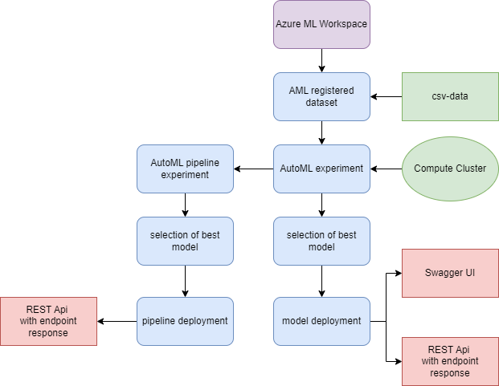

The diagram visualizes the overall MLOps workflow in this
project from data to the final pipeline: 

1. Data: we start by uploading the provided csv-file and creating a data asset in Azure ML
2. Computational resources: we create a compute cluster and a compute instance to power the model training and the used notebooks
3. AutoML-experiment: using the provided dataset, we use AutoML to automatically train and select the best model for the task
4. Deployment:
   - we pick the best model from the AutoML experiment and deploy it in an endpoint
   - thanks to the Azure ML utilities, we can conveniently access the Swagger API - documentation of our endpoint and inspect it locally
   - we can access and consume the endpoint after deployment, using the `endpoint.py` - script from the local machine (VM)
   - optionally, we can also benchmark the endpoint
   - on top of that, we design and create a AML-pipeline
5. Pipeline Automation of our workflow:
   - we run a AutoML experiment in the pipeline as a pipeline step and select the best model 
   - we publish the pipeline and deploy a REST-endpoint for downstream consumption using a jupyter notebook

## Key Steps

The main workflow has been outlined above. The following steps detail the workflow from dataset ingestion toward
model and pipeline deployment.

- 1. Create a dataset asset in Azure ML
     For our ML task, we upload and create a data asset in our Azure ML workspace to kickstart our work. For this,
     we upload the bank marketing dataset (UCI). 
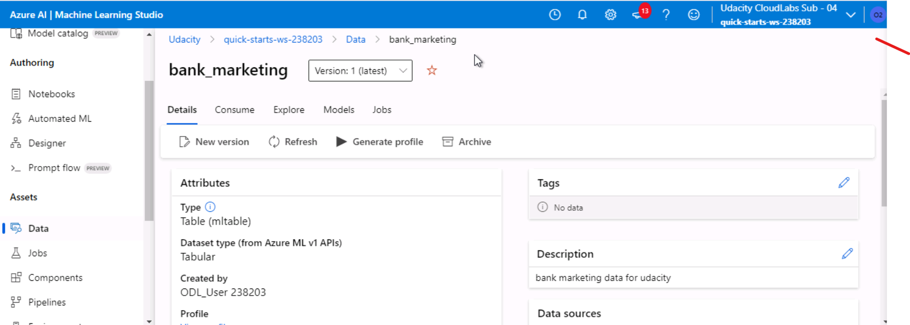
- 2. Run an Auto ML experiment in the cloud by calling Azure ML from the local machine
     To be able to start up our ML task and experimentation, we created a compute instance for our Azure ML Studio
     notebooks and a compute cluster for our Auto ML experiments. Then we create an Auto ML experiment, using our
     data asset, to automatically train several models for our taks and select the best model for deployment.
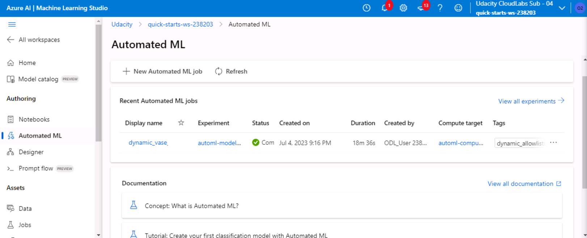
- 3. Select the best model for deployment
    After successfully running and completing the Auto ML experiment, we choose the best model - which for us has
    been the Voting ensemble with ~ 92% accuracy - for deployment to an Azure Container Instance (ACI) and initialized the endpoint.
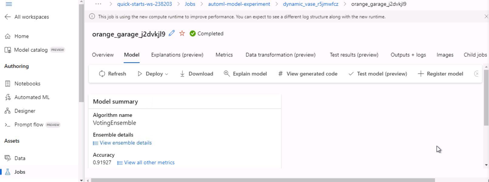
- 4. Enable application insights
    Having deployed the model to an endpoint, we enabled the monitoring of our service by configuring our service
    endpoint for allowing Application Insights. This allows us to visualize and monitor service performance closely.
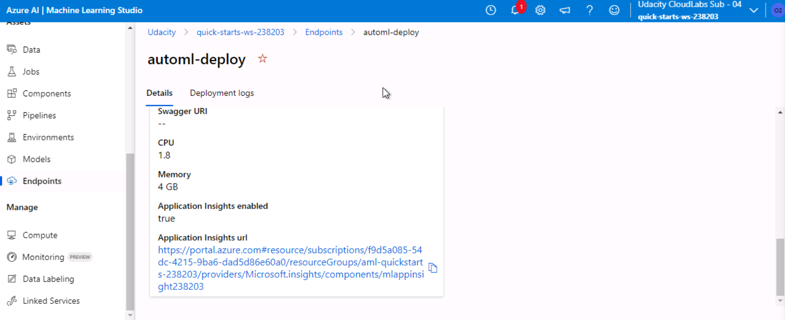
- 5. Programmatically retrieving logs from the endpoint
     After enabling Application Insights, we retrieve the logs for our service using the provided .py - scripts
     on the local machine (VM) and inspect them shortly - the deployment is healthy in our case.

- 6. Check the Swagger UI - API documentation
     Swagger is a versatile and helpful tool for building, consuming and documenting RESTful APIs deployed in Azure ML.
     We thus use the automatically generated swagger.json file provided for our service endpoint and download it to the
     local machine (VM). Then, we use it - together with the swagger.sh and serve.py script to inspect our generated localhost
     webiste documenting the endpoint for our deployed model.
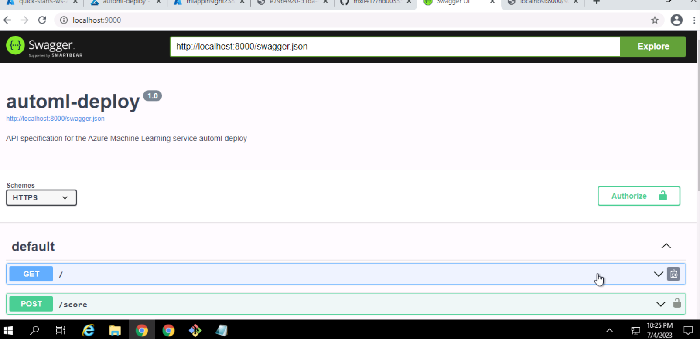
- 7. Optional step: Benchmark the endpoint with Apache Benchmarking
     Additionally, we also benchmark our service endpoint using the provided apache benchmarking script (benchmark.sh).
     Here we can see some statistics and interesting insights for our service endpoint - like transfer rates, connection times,
     and response timings.
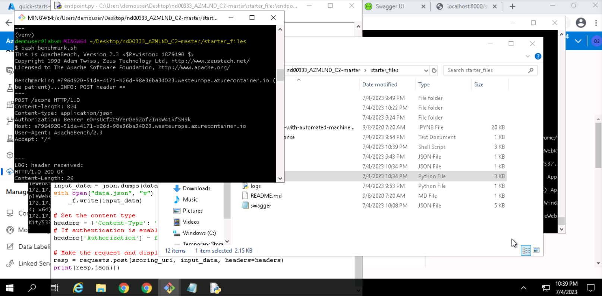
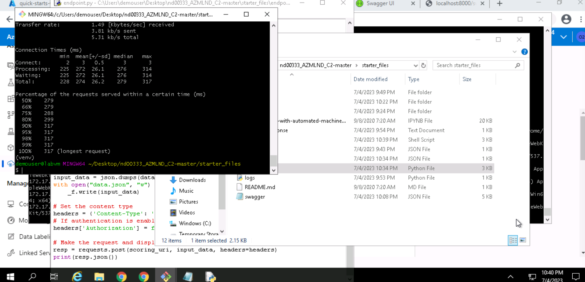
- 8. Consume the endpoint programmatically
     To finally make use of our endpoint, we use the provided .py scripts (endpoint.py) to submit an HTTP POST request with the provided
     data payload (data.json) to retrieve a response for our data. This is done after providing the correct URI and key for our endpoint.
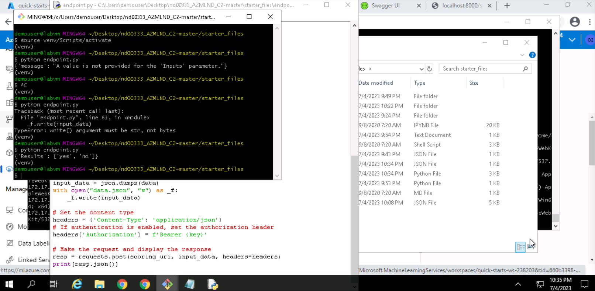
- 9. Create the pipeline and pipeline jobs
     For making the best use of our data asset, provide the most reproducible and reliable machine learning results and models,
     and stick to best practices of ML operations, we lastly setup a pipeline for automating our previous workflow and publish it,
     providing another RESTful endpoint.
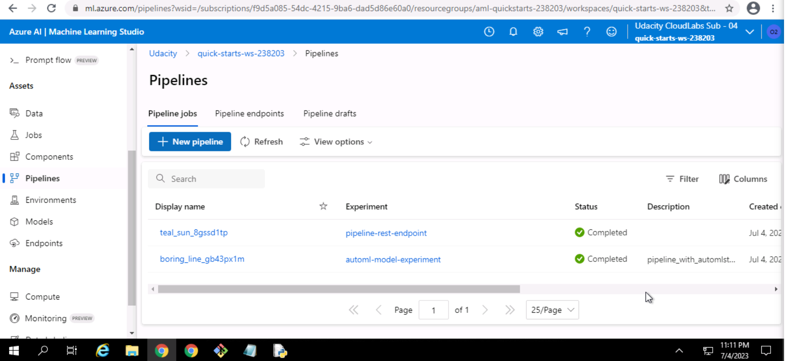
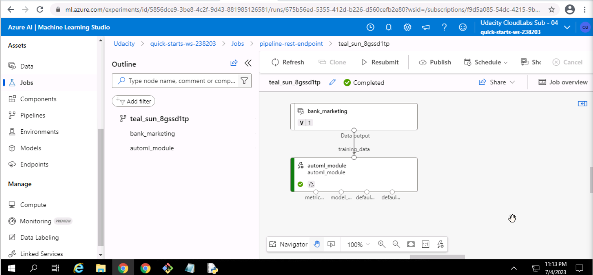
- 10. Create and run the notebook experiment
      To do everything noted in step 9, we complete the provided jupyter notebook, setup and provide the pipeline with an Auto ML
      step and finally run, check and publish our pipeline using the notebook code. 
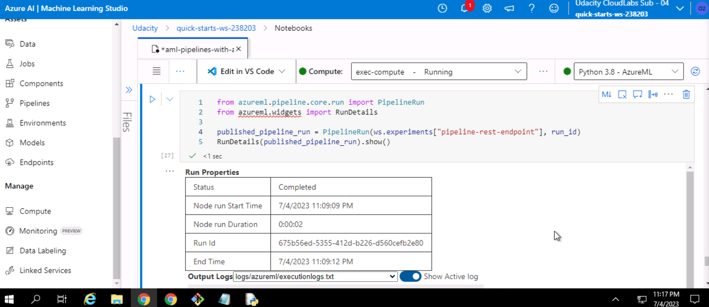
- 11. Published pipeline overview and pipeline endpoint
      After completing the Auto ML learning, model selection and pipeline publishing, we can inspect the published final model endpoint
      and have automated our previous workflow, using ML Ops best practices and tools.
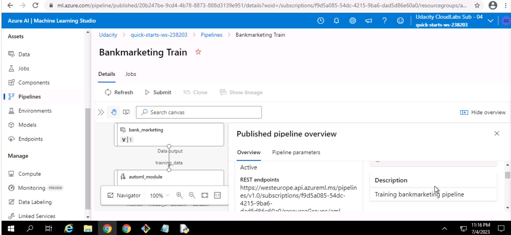
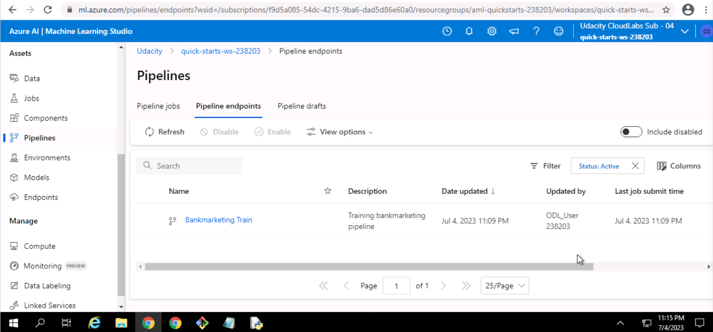

## Screen Recording
Screencast is online on Youtube: [https://youtu.be/HkqOBA1D9MQ](https://youtu.be/HkqOBA1D9MQ)

## Standout Suggestions
- besides benchmarking for pure response times, 
it might be interesting to also check for predictions
of out-of-distribution samples or synthesized samples with extreme values
- a/b testing between different AutoML models might also be interesting and of great value for practitioners seeking to make the most of the Azure ML automation capabilities
