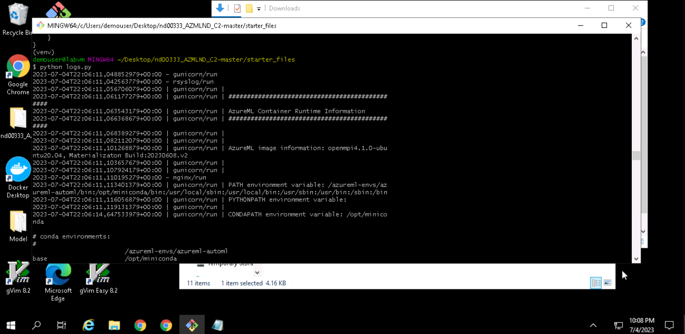

# Operationalizing machine learning with Azure - train, deploy, consume

In the final project of the second part of the course "Machine Learning with Microsoft Azure" 
we go through a full MLOps workflow, training a model for a bank marketing dataset, deploying
it into production and of course consuming the endpoint. Additionally, we create and deploy
a AutoML-backed pipeline and publish it for downstream consumption.

## Architectural Diagram

The diagram visualizes the overall MLOps workflow in this
project:

- we start by ingesting the training data into our workspace
- using the dataset, we create an AutoML experiment
that yields various models
- we pick the best model and deploy it into production
- thanks to the Azure ML utilities, we can conveniently access the Swagger API - documentation of our endpoint and inspect it locally
- we can access and consume the endpoint after deployment, using the `endpoint.py` - script
- optionally, we can also benchmark the endpoint
- on top of that, we design and create a AML-pipeline
- we run a AutoML experiment in the pipeline as a pipeline step and select the best model 
- we publish the pipeline and deploy a REST-endpoint for
downstream consumption

## Key Steps

The main steps have been outlined above. The following steps detail the workflow from dataset ingestion toward
model and pipeline deployment.

- Create a dataset asset in Azure ML

- Run an AutoML experiment using local files

- Select the best model for deployment

- Enable application insights

- Programmatically get logs from the endpoint

- Check the Swagger UI - API documentation

- Benchmark the endpoint with Apache Benchmarking

- Consume the endpoint programmatically

- Create the pipeline and pipeline jobs

- Create and run the notebook experiment

- Published pipeline overview and pipeline endpoint

## Screen Recording
Screencast is online on Youtube: [https://youtu.be/HkqOBA1D9MQ](https://youtu.be/HkqOBA1D9MQ)

## Standout Suggestions
- besides benchmarking for pure response times, 
it might be interesting to also check for predictions
of out-of-distribution samples or synthesized samples with extreme values
- a/b testing between different AutoML models might also be interesting and of great value for practitioners seeking to make the most of the Azure ML automation capabilities
